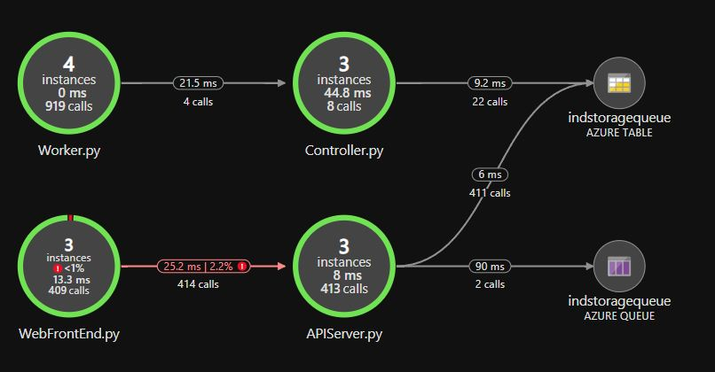

# IND DateChecker

Test app (checks available dates on IND date planner websites using Selenium) running in an AKS cluster.
Can handle single date check requests (check if a date is available in the specified period only once) or continuous checks (run repeatedly until a date in the specified period is found).

Application insights - Application Map:

Components:
- AKS:
  - Azure public load balancer
    - Exposes Web frontend pod(s) 
  - Cluster IP services:
    - For internal DNS name to API servers
    - For internal DNS name to Controllers
  - Pod deployments:
    - Web frontend container
      - Runs FLASK to present front end
      - OpenCensus application logging&correlation
    - API container
      - Runs Flask to accept http requests
      - Handles making new date check requests, checking for results of previous checks, etc.
      - OpenCensus application logging&correlation
    - Controller container
      - Finds jobs in Azure Table and Message Queue
      - Distributes jobs to workers
      - Keeps track- and takes care of running workers and jobs
      - Emails results for continuous jobs
      - OpenCensus application logging&correlation
    - Worker container
      - Registers to a controller and waits for job assignments
      - Uses Selenium to check for dates  
      - Executes run-once jobs and writes result to database
      - Executes continuous jobs and stores result in database if a date is found, else runs again periodically
      - OpenCensus application logging&correlation
  - HPA for each deployment for auto scaling
- Azure storage account:
  - Queue:
    - Messages requesting a single date check
  - Table:
    - Entities for continuous date checks (i.e. run repeatedly until an available date is found) 
    - Entities for result of previous runs 
    - Entities for live worker containers
    - entities for live jobs
- Azure Application Insights
  - Logging & correlation from all components through OpenCensus integration in Python 
